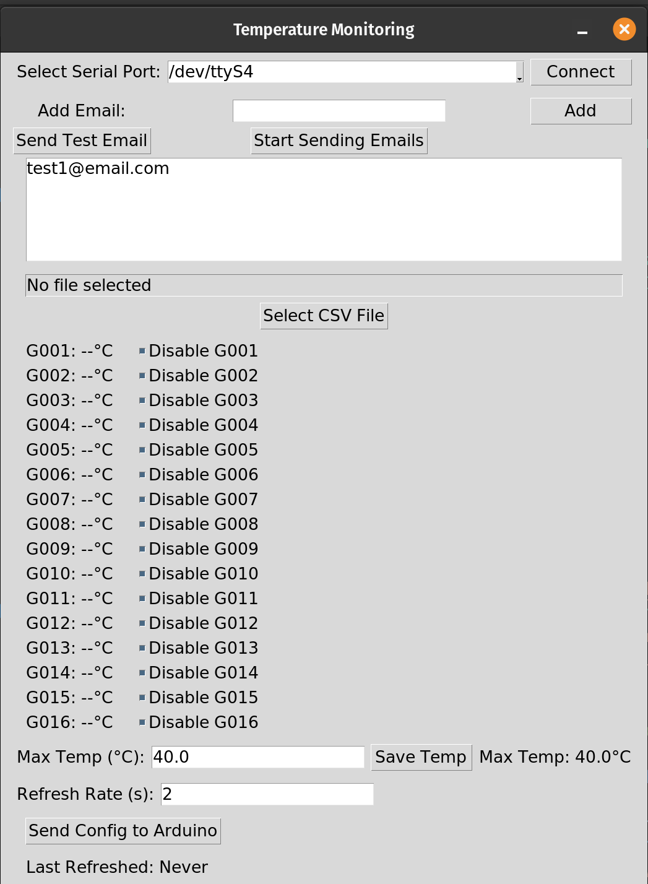
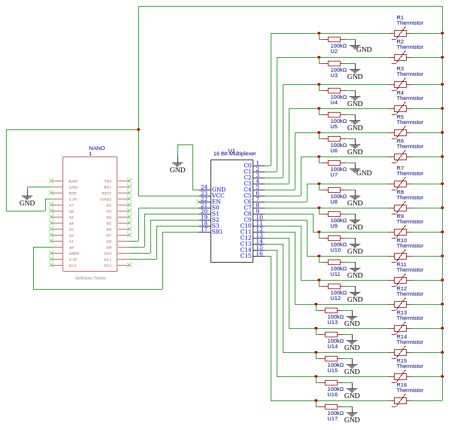

# Temperature Monitor

This project utilizes an Arduino connected to a multiplexer to read temperatures from up to 16 thermistors. It features a GUI for real-time temperature monitoring, email alerts for temperatures exceeding predefined limits, webhook support for hourly updates (ideal for Discord notifications), and CSV logging for all captured data.

## Features
- **Real-time Temperature Monitoring**: Utilizes a GUI to display current temperatures read from up to 16 thermistors.
- **Email Alerts**: Sends email notifications if temperatures exceed user-defined thresholds.
- **Webhook Support**: Sends temperature data every hour to a specified webhook URL, allowing integration with services like Discord.
- **CSV Logging**: Records all temperature readings into a CSV file for historical data analysis.

## Requirements
- Python 3.8 or newer
- Arduino IDE
- Various Python libraries listed in `requirements.txt`

## Setup
1. **Hardware Setup**: Connect your Arduino to the multiplexer and thermistors according to the provided schematics.
2. **Software Installation**: Install the necessary Python libraries using `pip install -r requirements.txt`.
3. **Arduino Configuration**: Upload the `main.cpp` sketch to your Arduino.
4. **Starting the GUI**: Run `main.py` to launch the temperature monitoring GUI.

## Usage
- **GUI**: The graphical interface shows real-time temperatures, allows setting the alert threshold, and displays alerts.
- **Email Configuration**: Edit `emails.json` to add or remove email recipients for alerts.
- **Webhook Configuration**: Set your webhook URL in the GUI to enable hourly updates.
- **CSV File**: Temperature data is automatically logged in the specified CSV file.

## Gallery

## License
This project is licensed under the MIT License - see the [LICENSE](LICENSE) file for details.

THE SOFTWARE IS PROVIDED "AS IS", WITHOUT WARRANTY OF ANY KIND, EXPRESS OR
IMPLIED, INCLUDING BUT NOT LIMITED TO THE WARRANTIES OF MERCHANTABILITY,
FITNESS FOR A PARTICULAR PURPOSE AND NONINFRINGEMENT. IN NO EVENT SHALL THE
AUTHORS OR COPYRIGHT HOLDERS BE LIABLE FOR ANY CLAIM, DAMAGES OR OTHER
LIABILITY, WHETHER IN AN ACTION OF CONTRACT, TORT OR OTHERWISE, ARISING FROM,
OUT OF OR IN CONNECTION WITH THE SOFTWARE OR THE USE OR OTHER DEALINGS IN THE
SOFTWARE.
